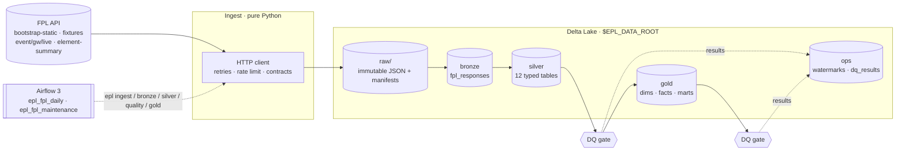
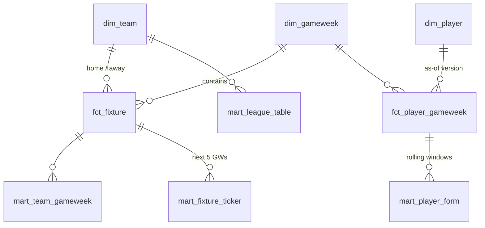

# EPL FPL Lakehouse

[](https://github.com/rohit91jacob/epl-fpl-lakehouse/actions/workflows/ci.yml)
[](https://github.com/rohit91jacob/epl-fpl-lakehouse/actions/workflows/refresh.yml)
[](https://rohit91jacob.github.io/epl-fpl-lakehouse/)
[](LICENSE)


An end-to-end data pipeline for **English Premier League** data from the
[Fantasy Premier League](https://fantasy.premierleague.com) API.

- Python ingestion lands every API response unmodified in a checksummed raw zone.
- **PySpark + Delta Lake** turn it into bronze, silver and gold layers.
- Data-quality gates sit between the layers, and every stage is idempotent and
  incremental.
- **Apache Airflow** orchestrates the stages. CI runs the full stack in Docker.

**Live results, rebuilt every morning:** https://rohit91jacob.github.io/epl-fpl-lakehouse/

It produces a dimensional model and analytics marts: league standings after every
gameweek, player form and value, team xG, a fixture-difficulty ticker, and a type-2
player dimension that tracks price and transfer history.

> Verified against live data (2026-27, after gameweek 5): the computed league table
> matches the positions FPL publishes for **20/20 clubs**, and per-player season totals
> (points, goals, minutes) match FPL's figures for **all 667 players**. All 46
> data-quality checks pass.

---

## Architecture



| Component | Responsibility | Code |
|---|---|---|
| FPL client | Retries with exponential backoff (honours `Retry-After`), rate limiting, response contracts, and an offline `file://` transport | `ingestion/client.py` |
| Raw landing zone | Atomic writes of the exact response bytes, per-run manifests with SHA-256, and incremental state | `ingestion/landing.py`, `ingestion/pipeline.py` |
| Bronze | Append-only Delta table, one row per response, with full lineage | `bronze.py` |
| Silver | Schema-on-read parsing, typing, MERGE or replace semantics, and watermarks | `silver.py`, `schemas.py` |
| Gold | SCD2 player dimension, facts, and marts rebuilt per season | `gold.py` |
| Data quality | Declarative checks; results persisted; `error` checks fail the run | `quality/` |
| Orchestration | Airflow DAGs that call the `epl` CLI | `dags/` |
| Maintenance | `OPTIMIZE` + `VACUUM` | `maintenance.py` |
| Results site | Static, script-free HTML + `data.json` from gold, published to GitHub Pages | `report.py` |

## Tech stack

| | Version | Why |
|---|---|---|
| Python | 3.12 | |
| Apache Spark (PySpark) | 4.1.1 | Runs locally by default; point `EPL_SPARK_MASTER` at a cluster to scale |
| Delta Lake | 4.3.1 | ACID, MERGE, `replaceWhere`, time travel; pinned as a pair with Spark |
| Java | 17 or 21 | Required by Spark 4 |
| Apache Airflow | 3.3.2 | LocalExecutor + Postgres 16 in Docker Compose |
| requests / urllib3 | 2.x | HTTP with retry adapters |
| uv, ruff, mypy, pytest | latest | Locked dev toolchain (`uv.lock`) |

## Data source

| Endpoint | What | Fetched |
|---|---|---|
| `bootstrap-static/` | teams, players (price, status, totals), gameweeks, positions | every run |
| `fixtures/` | all 380 fixtures, scores, per-player match stats | every run |
| `event/{gw}/live/` | every player's stats and points breakdown for a gameweek | each started gameweek, until FPL marks it final (`data_checked`) |
| `element-summary/{id}/` | per-fixture player history (exact price at the time) and past seasons | every run, unchanged responses skipped (`EPL_INGEST_PLAYER_HISTORY`) |

The FPL API is public but undocumented, and the data belongs to the Premier League. This
project redistributes **no FPL data**: you fetch it yourself, for personal and
educational use, in line with the
[FPL terms](https://fantasy.premierleague.com/help/terms). The client identifies itself
and rate-limits to 4 requests/second by default. The bundled sample data
(`epl sample-data`) is **synthetic** with fictional clubs and players, and is used for
tests, CI and offline demos. This project is not affiliated with the Premier League.

## Data model



| Layer | Tables |
|---|---|
| bronze | `fpl_responses` |
| silver | `teams`, `positions`, `gameweeks`, `gameweek_chip_plays`, `players`, `player_snapshots`, `fixtures`, `fixture_player_stats`, `player_gameweek_stats`, `player_gameweek_explain`, `player_fixture_history`, `player_past_seasons` |
| gold | `dim_team`, `dim_gameweek`, `dim_player` (SCD2), `fct_fixture`, `fct_player_gameweek`, `mart_league_table`, `mart_player_form`, `mart_team_gameweek`, `mart_fixture_ticker` |
| ops | `bronze_loaded_runs`, `watermarks`, `dq_results` |

The grain, keys, write mode and every column are in
**[docs/data_dictionary.md](docs/data_dictionary.md)**.

## Quickstart

**Prerequisites:** [uv](https://docs.astral.sh/uv/), and Java 17+ on `PATH` (for
Spark). Docker is needed only for the Airflow stack. Linux, macOS or WSL2.

```bash
git clone https://github.com/rohit91jacob/epl-fpl-lakehouse.git
cd epl-fpl-lakehouse
uv sync                      # creates .venv with the pinned toolchain
```

### Offline: synthetic data, no network needed after `uv sync`

```bash
uv run epl sample-data --out ./data/sample-api        # prints file:///.../sample-api
export EPL_FPL_BASE_URL=file://$PWD/data/sample-api
uv run epl run                                        # ingest → bronze → silver → DQ → gold → DQ
```

The first Spark start downloads the Delta Lake jars and their dependencies into `~/.ivy2.5.2`. This happens once; the Docker images bake them in.

### Live: the real FPL API

```bash
unset EPL_FPL_BASE_URL
uv run epl run          # about 10 minutes including ~670 polite API calls
uv run epl show gold.mart_league_table --where "as_of_gameweek = 5" --order-by position \
  --columns position,team_name,played,won,drawn,lost,goal_difference,points,form_last5 --limit 5
```

```text
+--------+---------+------+---+-----+----+---------------+------+----------+
|position|team_name|played|won|drawn|lost|goal_difference|points|form_last5|
+--------+---------+------+---+-----+----+---------------+------+----------+
|1       |Man City |5     |5  |0    |0   |8              |15    |WWWWW     |
|2       |Arsenal  |5     |4  |0    |1   |4              |12    |WWWWL     |
|3       |Brighton |5     |3  |1    |1   |11             |10    |WLDWW     |
|4       |Brentford|5     |2  |3    |0   |6              |9     |WDDDW     |
|5       |Leeds    |5     |2  |3    |0   |4              |9     |WDDWD     |
+--------+---------+------+---+-----+----+---------------+------+----------+
```

More examples:

```bash
uv run epl show gold.mart_player_form --where "gameweek_id = 5" --order-by "points_last5 DESC" \
  --columns web_name,price_m,points_last5,xgi_last5,points_per_million_last5 --limit 5
uv run epl show gold.mart_fixture_ticker --order-by avg_difficulty --columns team_id,avg_difficulty,ticker
uv run epl show ops.dq_results --where "NOT passed"      # empty when all checks pass
uv run epl report --out site                             # the results site: site/index.html
```

Each stage can also run on its own: `epl ingest`, `epl bronze`, `epl silver`,
`epl quality --layer silver|gold|all`, `epl gold`, `epl maintenance`. See `epl --help`.

### Airflow with Docker Compose *(verified in CI: `compose-e2e` job)*

```bash
cp .env.example .env          # set AIRFLOW_JWT_SECRET / AIRFLOW_FERNET_KEY for anything shared
docker compose up -d --build  # http://localhost:8080  (admin / admin)
```

Unpause `epl_fpl_daily`, which runs daily at 06:00 UTC, or trigger it with
`{"full_refresh": true}` to rebuild everything. The lake lives in the `lake` volume. To
run once without Airflow:

```bash
docker compose --profile standalone run --rm pipeline run
```

## Configuration

Every setting is an environment variable. Copy [.env.example](.env.example) to start.

| Variable | Default | Purpose |
|---|---|---|
| `EPL_DATA_ROOT` | `./data` | Root of `raw/`, `bronze/`, `silver/`, `gold/`, `ops/` |
| `EPL_FPL_BASE_URL` | `https://fantasy.premierleague.com/api` | API base URL, or `file:///dir` for captured or synthetic responses |
| `EPL_INGEST_PLAYER_HISTORY` | `true` | Fetch `element-summary` for every player (exact historical prices) |
| `EPL_HTTP_TIMEOUT_SECONDS` | `30` | Per-request timeout |
| `EPL_HTTP_MAX_RETRIES` / `EPL_HTTP_BACKOFF_SECONDS` | `5` / `1.0` | Retries on 429/5xx with exponential backoff |
| `EPL_MAX_REQUESTS_PER_SECOND` / `EPL_MAX_WORKERS` | `4` / `4` | Politeness limits |
| `EPL_SPARK_MASTER` | `local[*]` | Spark master URL |
| `EPL_SPARK_DRIVER_MEMORY` | `2g` | |
| `EPL_SPARK_SHUFFLE_PARTITIONS` | `8` | Also sets Delta snapshot parallelism |
| `EPL_SPARK_JARS` | *(empty)* | Pre-provisioned jars (the Docker images set this; no Maven at runtime) |
| `EPL_LOG_LEVEL` / `EPL_LOG_FORMAT` | `INFO` / `json` | JSON lines for log shippers, or `text` |
| `EPL_EXPECTED_TEAM_COUNT` | `20` | Used by the data-quality checks |
| `EPL_VACUUM_RETENTION_HOURS` | `168` | Time-travel window kept by `VACUUM` |

## Testing and CI

```bash
uv run pytest -m "not spark and not airflow"   # fast: client, ingestion, sample data, CLI
uv run pytest -m "not airflow"                 # + Spark end-to-end (needs Java 17+)
uv run ruff check . && uv run ruff format --check . && uv run mypy
```

The Spark suite builds a lake from the synthetic API and checks it against **an
independent pure-Python oracle**. It replays a realistic sequence:
1. a run after gameweek 5;
2. a no-op rerun, asserting zero new Delta commits and identical gold;
3. a run after gameweek 6, asserting history is unchanged and new SCD2 versions appear for
   exactly the players whose price moved.

The synthetic season includes a blank gameweek, a double gameweek, a postponed fixture
and own goals. The HTTP tests use a real local server, so the urllib3 retry logic
actually runs.

| CI job | What it proves |
|---|---|
| `lint` | ruff lint + format, mypy on `src/` |
| `test` | every non-Airflow test on Java 17, with coverage |
| `airflow` | DAGs import cleanly on Airflow 3.3.2 (official constraints); task order and retry policy |
| `docker` | builds the pipeline image and runs the full pipeline inside it on synthetic data |
| `compose-e2e` | boots Airflow + Postgres with Docker Compose, runs `airflow dags test epl_fpl_daily`, then re-runs every data-quality check inside the stack |

Two more workflows keep the data current:

| Workflow | Schedule | What it does |
|---|---|---|
| `refresh.yml` | daily 06:30 UTC, or manual (with an optional full refresh) | Restores the lake from the Actions cache, runs `epl run` against the live API (incremental), runs maintenance on Mondays, saves the lake, builds the results site and deploys it to GitHub Pages. On a scheduled failure it opens a `Scheduled refresh is failing` issue, or comments on the open one. |
| `keepalive.yml` | 1st of each month | GitHub disables scheduled workflows in public repos after 60 days without activity; this re-enables them through the API, with no dummy commits. |

Dependabot updates uv, GitHub Actions and Docker base images weekly. Spark and Delta are
pinned and bumped together by hand. Pre-commit runs ruff and basic hygiene hooks.

## Operations

- **Schedule:** the hosted refresh is the GitHub Actions `refresh.yml` workflow (daily 06:30 UTC),
  which publishes the live results site. For self-hosted deployments the same stages run as the
  Airflow DAG `epl_fpl_daily` (06:00 UTC) plus `epl_fpl_maintenance` (Mondays 03:00 UTC).
- **Credentials: none to maintain.** The FPL API is public, and publishing uses GitHub's
  built-in per-run `GITHUB_TOKEN`, so nothing expires or needs rotating.
- **Where the lake lives on GitHub:** the Actions cache, restored at the start of each run and
  saved at the end. If the cache is evicted (7 days unused, or the 10 GB repo limit), the next
  run rebuilds the lake from the API. Standings and facts come back exactly; `dim_player`
  price history restarts from that day.
- **Incremental:** final gameweeks are never refetched, unchanged responses are not
  stored again, silver processes only bronze rows newer than its watermark, and gold
  rebuilds only the seasons present.
- **Idempotent:** every stage can be retried or re-run safely
  ([ADR 0002](docs/adr/0002-idempotent-writes.md)).
- **Data-quality gates:** silver and gold suites (46 checks) cover keys, nulls,
  referential integrity, ranges, scorelines reconciling with goal scorers, league-wide
  balance (goals for = goals against, wins = losses), SCD2 validity, and a comparison
  with FPL's published table. Results go to `ops.dq_results`. Exit code `2` means an
  `error` check failed.
- **Backfill, reprocessing, failure triage and new-season handling:**
  **[docs/runbook.md](docs/runbook.md)**.

## Project structure

```text
├── src/epl_lakehouse/
│   ├── cli.py                 # `epl` command: one subcommand per stage
│   ├── config.py              # EPL_* settings
│   ├── ingestion/             # client.py · landing.py · pipeline.py (no Spark needed)
│   ├── bronze.py · silver.py · gold.py · schemas.py · delta_io.py · ops.py
│   ├── quality/               # framework.py · suites.py · results.py
│   ├── maintenance.py         # OPTIMIZE + VACUUM
│   ├── report.py              # static results site (GitHub Pages)
│   ├── spark_session.py
│   └── sample.py              # deterministic synthetic FPL API
├── dags/                      # epl_fpl_daily.py · epl_fpl_maintenance.py
├── tests/                     # unit, HTTP, ingestion, Spark e2e vs oracle, DQ, CLI, DAGs
├── docs/                      # data_dictionary.md · runbook.md · adr/
├── Dockerfile                 # standalone pipeline image (Delta jars baked in)
├── docker/airflow/Dockerfile  # Airflow + Java + epl
├── docker-compose.yml         # Airflow 3 + Postgres (+ standalone profile)
├── .github/                   # CI, daily refresh + Pages, keep-alive, Dependabot
└── pyproject.toml · uv.lock · Makefile · .env.example
```

## Design rationale

Four constraints shaped the design. The source is a public but undocumented API that
publishes mutable snapshots: prices, availability and provisional bonus points change
during a gameweek, and FPL revises history until it sets `data_checked`. The data belongs
to the Premier League and stays out of the repository, so tests, CI and offline demos run
on a synthetic API. The hosted refresh runs unattended on free GitHub-hosted runners, with
no credentials to rotate and no cloud account. And the same code has to run on a laptop,
in Docker and under Airflow, with a path to a cluster.

### Architecture decisions

| Decision | Why | Alternatives considered | Trade-off accepted |
|---|---|---|---|
| **Immutable raw zone, then medallion layers on Delta Lake** ([ADR 0001](docs/adr/0001-medallion-on-delta-lake.md)) | Mutable snapshots need an exact record. Every response is landed byte for byte with a SHA-256 manifest (`ingestion/landing.py`), each layer can be rebuilt from the one below, and Delta adds ACID writes, MERGE and time travel. | Parsing responses straight into typed tables, with no raw copy; a single relational database | Each landed response is stored twice (raw file and bronze `payload`), and the Spark stages need a JVM and the Delta jars. |
| **Ingestion in plain Python, apart from Spark** (`ingestion/`) | Fetching is I/O-bound and rate-limited, so it needs no JVM. Response contracts (`REQUIRED_KEYS`) fail fast when FPL changes a shape, and a `file://` transport replays captured or synthetic responses through the same code. | Fetching inside Spark jobs; a connector framework such as Airbyte or dlt | A client, rate limiter and contracts to maintain, and two runtimes behind one CLI (Spark is imported lazily, so `epl ingest` starts without a JVM). |
| **MERGE for entities, `replaceWhere` for facts** ([ADR 0002](docs/adr/0002-idempotent-writes.md)) | A newer `event/<gw>/live` or `fixtures` payload can *remove* rows, such as withdrawn provisional bonus points, which a key-based MERGE would leave behind. Entity MERGEs update a row only when the source `fetched_at` is strictly newer, so replays and out-of-order loads converge (`delta_io.py`). | MERGE for every table; overwriting whole tables on every run | Two write paths to reason about. A changed gameweek is rewritten whole, and each new `fixtures` payload replaces the season's `fixture_player_stats`. |
| **Incremental, idempotent stages** ([ADR 0002](docs/adr/0002-idempotent-writes.md)) | Final gameweeks are not refetched, byte-identical responses are not landed again, and a failed run doesn't advance state. Bronze is an insert-only MERGE on `(endpoint, resource_id, season, run_id)`; silver reads only bronze rows past its per-endpoint watermark, so a no-op rerun commits nothing to silver (asserted in `tests/test_pipeline.py`). | Refetching and reprocessing everything on every run (kept as `--full-refresh`); watermarks held by the orchestrator | Bookkeeping lives in three places (`raw/_state/`, `ops.bronze_loaded_runs`, `ops.watermarks`). `element-summary` is still fetched for every player on every run; only storing an unchanged response is skipped. |
| **Gold and the SCD2 player dimension recomputed per season** ([ADR 0003](docs/adr/0003-scd2-from-daily-snapshots.md)) | Every silver and gold key includes the season (FPL ids restart each season), and a season is small: 20 teams, ~700 players, 380 fixtures. Swapping whole seasons in with `replaceWhere` keeps gold deterministic, and versioning `dim_player` from daily snapshots handles A → B → A changes with no update logic. | Incremental MERGEs into gold; an SCD2 MERGE that closes and opens versions on each load | Every run rewrites gold for every season in silver. That is cheap at this size (ADR 0003 puts the snapshots at roughly 200k rows a season) but grows with the seasons kept. |
| **Data-quality gates between layers** (`quality/`) | 46 checks: one suite after silver, one after gold. A failed `error` check makes the CLI exit `2`, so a silver failure stops gold being rebuilt and a gold failure stops the hosted refresh before the lake is saved or the site is published. Every result is appended to `ops.dq_results`. | Great Expectations, Soda or PyDeequ, which are richer but add dependencies for checks that each reduce to a Spark count | A small in-house framework to maintain (`quality/framework.py`). Gold checks run after gold is written, so under Airflow a gold failure fails the run with the new tables already in place. |
| **Airflow runs the `epl` CLI** ([ADR 0004](docs/adr/0004-airflow-runs-the-cli.md)) | A task behaves exactly as it does in a terminal or a container, and each `BashOperator` task gets its own Spark JVM, freed when it ends. Exit codes separate failures (`1`) from data-quality stops (`2`), the gates don't retry, and swapping the orchestrator only means calling the same CLI. | `PythonOperator` tasks sharing a long-lived Spark session in the worker | A JVM start per task, and `max_active_runs=1` / `max_active_tasks=1` serialise the DAG to keep one writer per Delta table. |
| **Hosted refresh on GitHub Actions, served from Pages** (`refresh.yml`, `report.py`) | Nothing to provision or rotate: the API is public and deploys use the per-run `GITHUB_TOKEN`. The Actions cache carries the lake between runs, so the daily run stays incremental, and the site is static HTML with no scripts, plus `data.json`. | Committing the lake to the repository (FPL data in the repo); an object-store bucket (a cloud account and credentials); Airflow on an always-on host | The cache is best-effort storage (see below). The hosted path runs `epl run` in one process with no per-stage retries: a failed scheduled run opens or updates an issue and waits for the next schedule or a manual re-run. |
| **Synthetic API, checked against an independent oracle** (`sample.py`, `tests/test_pipeline.py`) | `epl sample-data` writes a seeded season of fictional clubs on the real paths and field names, with a blank and a double gameweek, a postponed fixture and own goals. The Spark suite replays GW5 → no-op rerun → GW6 and checks standings against a pure-Python oracle built from the same JSON. | Recorded real responses as fixtures (FPL data in the repo); HTTP mocks with no end-to-end run | Synthetic data can't show live quirks it doesn't model, so every run also compares the standings with FPL's published positions (`standings_match_fpl_published`, a `warn` check). |

### Stack choices

| Layer | Choice | Why this | Why not the alternatives |
|---|---|---|---|
| Language | Python 3.12 (`requires-python >=3.11,<3.14`) | One language for the HTTP client, PySpark transforms, Airflow DAGs and tests, with mypy (`disallow_untyped_defs`) on `src/`. | Scala Spark would add compile-time types, but also a build step and a second language next to the Python client and DAGs. |
| Processing | Apache Spark 4.1.1 (PySpark), `local[*]` by default | The same jobs run in local mode or on a cluster, with native Delta MERGE and the window functions behind SCD2 and rolling form. Cloud mapping: EMR, Dataproc or Databricks. | ADR 0001 concedes Spark is more than this volume needs; pandas, Polars or DuckDB would start faster with no JVM, but a move to a cluster would mean rewriting the transforms. |
| Table format | Delta Lake 4.3.1 (`delta-spark`), pinned as a pair with Spark | ACID MERGE, `replaceWhere` on data columns, time travel for `RESTORE`, and `OPTIMIZE`/`VACUUM`, all on plain directory paths. | Plain Parquet has no transactions or MERGE. Apache Iceberg is comparable but is normally used through a catalog; Delta needs only a directory and the pip package. |
| JVM | Java 17 (Temurin in CI, OpenJDK in the images) | Spark 4 requires Java 17 or later. | Java 21 also works, and the Airflow image falls back to it when its base has no Java 17 package; the `test` job and the pipeline image use 17. |
| HTTP | requests 2.34 with urllib3 2.8's `Retry` | Exponential backoff on 429/5xx that honours `Retry-After`, under a thread-safe rate limiter (4 requests/second by default), tested against a real local server. | An async client such as httpx or aiohttp would add little: the politeness limit, not concurrency, bounds throughput. |
| Orchestration | Apache Airflow 3.3.2, LocalExecutor, Postgres 16, in Docker Compose | Schedules, retries with exponential backoff, a `full_refresh` run parameter and run history. CI imports the DAGs under Airflow's official constraints and runs `airflow dags test` in Compose. Cloud mapping: MWAA or Cloud Composer. | Dagster or Prefect would fit as well, but Airflow has managed services on AWS and Google Cloud. Plain cron has no retries, parameters or run history. |
| Containers | `python:3.12-slim-bookworm` and `apache/airflow:3.3.2-python3.12` images, Delta jars baked in | Containers never fetch jars from Maven Central at runtime (`EPL_SPARK_JARS`), and CI runs the whole pipeline inside the image. | Resolving jars at start-up, as `uv run` does locally, needs network access on every fresh host. Kubernetes would be more than a single-host stack needs. |
| Toolchain | uv with `uv.lock`; ruff 0.16, mypy 2.4, pytest 9.1 | One lockfile for runtime and dev tools, installed with `uv sync --locked` in CI, and one tool (ruff) for linting, import order and formatting. | Poetry or pip-tools also lock but install more slowly; ruff replaces flake8, isort and black. |
| CI and hosting | GitHub Actions, GitHub Pages, Dependabot | Free for a public repository and credential-free with `GITHUB_TOKEN`. One platform runs CI, the daily refresh, the keep-alive and the site. | Cloud scheduling, compute and storage (EventBridge Scheduler, ECS and S3, or Cloud Scheduler, Cloud Run and GCS) would need an account, credentials and a budget. |
| Serving | Static `index.html` and `data.json` (`report.py`) | No server, scripts or external assets to run or patch, and the numbers are machine-readable as well. | Superset or Streamlit would need a running service; a SQL endpoint is on the roadmap. |

### What would change in production

- **Storage.** The lake is a local directory. Delta supports object stores, but
  `EPL_DATA_ROOT` is resolved as a filesystem path (`config.py`), raw landing relies on
  atomic file renames (`ingestion/landing.py`), and `epl maintenance` finds tables by
  listing `_delta_log` folders, so those three need object-store implementations first.
  On GitHub the directory lives in the Actions cache, which is best-effort: an eviction
  means a rebuild from the API and a restart of `dim_player` price history
  ([Operations](#operations)). Production would keep the lake in S3 or GCS, where that
  history survives.
- **Compute.** Spark runs in local mode, sized for small tables: 8 shuffle partitions
  (which also set Delta's snapshot parallelism) and a 2 GB driver. At larger scale the
  same transforms would run on a cluster or a managed Spark service with those settings
  raised, once the lake is on storage every executor can reach.
- **Orchestration and secrets.** The Compose stack is single-host: LocalExecutor, one
  Postgres, and `admin`/`admin`, a placeholder JWT secret and an empty Fernet key unless
  `.env` sets them. Production would run the DAGs on a managed or Kubernetes-based Airflow,
  with each task in the pipeline image and those secrets in a secrets manager, and the DAG
  would be the lake's only writer instead of the GitHub Actions refresh.
- **Serving.** The static page and `data.json` would be joined by a SQL endpoint for BI
  tools (Spark Thrift Server or DuckDB over Delta), with gold registered in a metastore
  instead of being read by path.
- **Monitoring.** Failures surface as a failed Airflow task or a
  `Scheduled refresh is failing` issue, and `warn` checks are only logged and recorded.
  Production would ship the JSON logs to a log platform, alert on failed runs and stale
  data, and watch trends in `ops.dq_results`.

**Known limitations**
- `dim_player` history starts at the first ingestion, because the API exposes only
  current state. Per-fixture prices from `element-summary` cover earlier gameweeks.
- League ties are broken by points, goal difference, goals scored, then name. The Premier
  League's head-to-head tie-breakers are not implemented.
- `mart_team_gameweek.xg_against` is an approximation: it takes the largest
  `expected_goals_conceded` among the club's players.

**Roadmap:** the object-store lake and SQL endpoint above, and multi-season backfill from
the `history_past` codes.

## License

[MIT](LICENSE) for the code. FPL data is the property of the Premier League and is not
included in this repository.
